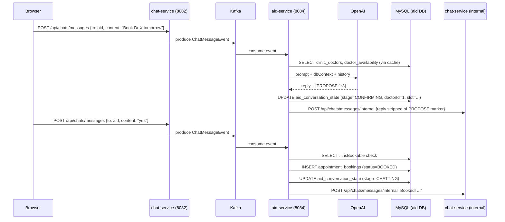
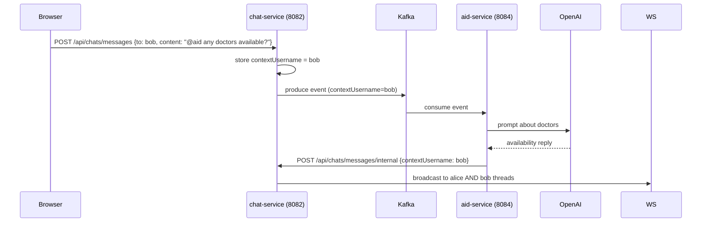

# Aid Service — Requirements Document

---

## 1. Functional Requirements

### FR-AID-01 Kafka Event Consumption
- The service shall consume events from Kafka topic `chat-messages` using group ID `aid-service`.
- Events with `generatedByBot = true` shall be discarded.
- Events where `receiverUsername` equals `aid` or content contains `@aid` shall be processed.

### FR-AID-02 Appointment Conversation State
- The service shall maintain a per-user conversation state persisted in `aid_conversation_state`.
- Stages: `CHATTING` (default) and `CONFIRMING` (awaiting booking confirmation).
- Sending "reset" or "start" shall return the user to `CHATTING` and return the greeting message.

### FR-AID-03 LLM-Driven Conversation
- In `CHATTING` stage, the service shall invoke the LLM (OpenAI) with:
  - A system prompt containing the clinic persona and rules.
  - Live doctor/slot data from the database.
  - Recent conversation history (last 20 messages).
  - The user's message.

### FR-AID-04 Booking Proposal
- The LLM shall append `[PROPOSE:doctorId:slotId]` when proposing a booking.
- The service shall parse this marker, transition to `CONFIRMING`, and strip the marker from the user-visible reply.

### FR-AID-05 Booking Confirmation
- In `CONFIRMING` stage, affirmative replies ("yes", "ok", "confirm", etc.) shall:
  - Verify the slot is still available.
  - INSERT a record into `appointment_bookings` with status `BOOKED`.
  - Evict the doctor's cached slots.
  - Reset the conversation to `CHATTING`.
- Negative replies ("no", "cancel", etc.) shall cancel the proposal and reset to `CHATTING`.

### FR-AID-06 Slot Availability Check
- Before booking, the service shall verify the slot exists in `doctor_availability` (enabled=true) and is not already in `appointment_bookings`.

### FR-AID-07 Reply Delivery
- The aid reply shall be posted to `POST /api/chats/messages/internal` on chat-service.
- `contextUsername` shall be forwarded for `@aid` mentions to surface the reply in the original thread.

### FR-AID-08 Fallback Mode
- If no OpenAI API key is configured, a friendly unavailability message shall be returned.

---

## 2. Non-Functional Requirements

### NFR-AID-01 Performance
- Doctor/slot queries shall be served from Redis cache (TTL-based eviction on booking).
- LLM latency is dependent on OpenAI.

### NFR-AID-02 Reliability
- LLM call failures shall be caught; a fallback message returned.
- Slot-taken race conditions are handled with a DB-level availability re-check before INSERT.

### NFR-AID-03 Data Integrity
- Appointment booking is transactional (`@Transactional`).
- `doctor_availability` has a unique constraint on `(doctor_id, available_at)`.
- `appointment_bookings` has a unique constraint on `(doctor_id, appointment_time)`.

### NFR-AID-04 Security
- No public REST API; internal-only via Kafka + chat-service callback.
- OpenAI key via environment variable / Docker secret.

### NFR-AID-05 Observability
- Logs: `logs/aid-service.log`, `logs/aid-service-error.log`.
- Actuator: health endpoint.

---

## 3. High-Level Architecture

```
Kafka (chat-messages topic)
        |
        v
aid-service (8084)
    |           |           |
    v           v           v
OpenAI API  MySQL (3309)  Redis
            aid DB       (doctor cache)
                |
                v
         chat-service (8082)
    POST /api/chats/messages/internal
```

---

## 4. High-Level Design

| Component | Responsibility |
|---|---|
| `AidMessageConsumer` | Kafka listener; filter; dispatch to AppointmentAssistantService |
| `AppointmentAssistantService` | Conversation state machine; LLM orchestration; booking |
| `DoctorCacheService` | Redis-cached doctor and slot queries |
| `AidReplyClient` | HTTP: POST to chat-service /internal |
| `ChatHistoryClient` | Conversation history from chat-service |
| `AidConversationState` | Per-user DB-persisted stage + proposal data |
| `AppointmentBooking` | Confirmed booking entity |

---

## 5. Low-Level Design

### Conversation Processing
```
AidMessageConsumer.consume(ChatMessageEvent)
  Skip if generatedByBot OR not (directAidChat OR @aid mention)
  prompt = sanitizePrompt(event.content)
  reply = AppointmentAssistantService.respond(event.senderUsername, prompt)
  AidReplyClient.send(new ChatMessageRequest(aidBot, sender, reply, contextUsername))

AppointmentAssistantService.respond(username, message)
  state = stateRepository.findByUsername(username) or new(CHATTING)
  if blank/reset → greet() + reset state
  if CONFIRMING + proposal set → handleConfirmation(state, message)
  else → handleChat(state, message)

handleChat(state, message)
  dbContext = DoctorCacheService.findActiveDoctors + upcoming slots (formatted)
  history = ChatHistoryClient.getConversationHistory(username, "aid") (last 20)
  raw = chatClient.prompt(SYSTEM_PROMPT + dbContext + history).user(message).call()
  if raw contains [PROPOSE:doctorId:slotId]
    → state.stage = CONFIRMING, save doctorId + proposedSlot
    → strip marker from reply
  return reply

handleConfirmation(state, message)
  if affirmative
    check isBookable(doctorId, slot)
    if bookable → bookingRepository.save(BOOKED) + evict cache + reset state
    else → "slot taken" message + reset state
  if negative → reset state + "no problem" message
  else → "please reply yes or no"
```

---

## 6. Technology Mapping

| Concern | Technology |
|---|---|
| Language | Java 21 |
| Framework | Spring Boot 3.x |
| AI | Spring AI (OpenAI) |
| Event Consumer | Apache Kafka |
| ORM | Spring Data JPA / Hibernate |
| Database | MySQL 8+ |
| Cache | Redis (doctor/slot cache) |
| Service Discovery | Netflix Eureka |
| Load Balancing | Spring Cloud LoadBalancer |
| API Docs | springdoc-openapi 2.8.x |
| Testing | JUnit 5, Mockito, TestContainers |

---

## 7. Sequence Diagrams

### 7.1 Booking Flow (Happy Path)



### 7.2 @aid Mention Flow



---

## 8. API Design

The aid-service has **no public REST API**. It communicates via:

- **Inbound**: Kafka topic `chat-messages`
- **Outbound**: `POST /api/chats/messages/internal` on chat-service

---

## 9. Database Diagram

```
aid-service MySQL database (port 3309)

+---------------------+       +------------------------+
|   clinic_doctors    |       |   doctor_availability  |
+---------------------+       +------------------------+
| id (PK)             |<------| id (PK)                |
| code (UNIQUE)       |       | doctor_id (FK)         |
| display_name        |       | available_at           |
| specialty           |       | enabled (BOOL)         |
| active (BOOL)       |       +------------------------+
+---------------------+               |
        |                             |
        v                             v
+---------------------+       +------------------------+
| appointment_bookings|       | aid_conversation_state |
+---------------------+       +------------------------+
| id (PK)             |       | id (PK)                |
| doctor_id (FK)      |       | username (UNIQUE)      |
| patient_username    |       | stage                  |
| appointment_time    |       | doctor_id              |
| status              |       | requested_slot         |
+---------------------+       | proposed_slot          |
                               | pending_options        |
                               +------------------------+
```

---

## 10. UI Design

The aid-service has no direct UI. Its output appears in the chat window when:

- A user opens a conversation with `aid` assistant in the sidebar
- A user sends `@aid` in any conversation and the reply routes back
- Booking confirmation messages appear as chat bubbles from `aid`
