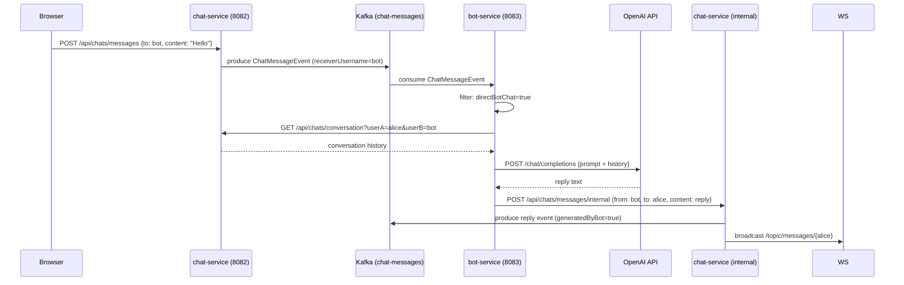
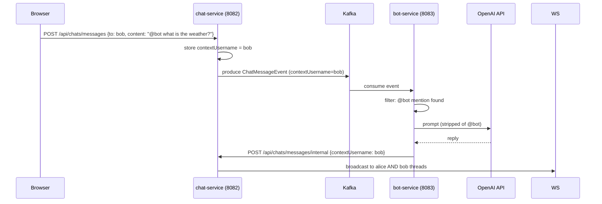

# Bot Service — Requirements Document

---

## 1. Functional Requirements

### FR-BS-01 Kafka Event Consumption
- The service shall consume all events from Kafka topic `chat-messages` using group ID `bot-service`.
- Events with `generatedByBot = true` shall be silently discarded to prevent reply loops.

### FR-BS-02 Message Filtering
- Events where `receiverUsername` equals `bot` (case-insensitive) shall be processed as direct bot conversations.
- Events containing `@bot` in the content (case-insensitive) shall be processed as mention-based interactions.
- All other events shall be discarded.

### FR-BS-03 Conversation History
- Before invoking the AI model, the service shall fetch recent conversation history between the sender and `bot` from chat-service.
- History shall be trimmed to a maximum of 20 messages and 5,000 characters to stay within model context limits.
- Fetched history shall be cached in-memory to reduce HTTP calls on follow-up messages.

### FR-BS-04 AI Response Generation
- The service shall use Spring AI (OpenAI) to generate a short, conversational reply.
- A system prompt shall establish the assistant persona: concise, helpful, conversational.
- The `@bot` mention shall be stripped from the prompt before sending to the AI.

### FR-BS-05 Reply Delivery
- The AI-generated reply shall be posted to `POST /api/chats/messages/internal` on chat-service.
- The reply sender identity shall use the `bot` assistant profile from `AssistantProfile.BOT`.
- When the trigger was an `@bot` mention, `contextUsername` shall be forwarded so the reply appears in the original thread.

### FR-BS-06 Fallback Mode
- If no OpenAI API key is configured, the service shall return a static fallback message instead of throwing an exception.

---

## 2. Non-Functional Requirements

### NFR-BS-01 Performance
- AI call latency is dependent on OpenAI; no internal SLA applies beyond timeout handling.
- In-memory history cache eliminates redundant HTTP calls for warm sessions.

### NFR-BS-02 Reliability
- The Kafka consumer shall not commit the offset on processing failure (dead-letter handling is a future concern).
- OpenAI call failures shall be caught and a fallback reply returned — the consumer shall not crash.

### NFR-BS-03 Security
- The service has no public REST API surface; it is internal-only.
- The OpenAI API key shall be provided via environment variable / Docker secret — never hard-coded.

### NFR-BS-04 Scalability
- Multiple instances can consume from the same Kafka consumer group for parallel processing.
- In-memory cache is per-instance; a shared Redis cache is a future improvement.

### NFR-BS-05 Observability
- Logs: `logs/bot-service.log`, `logs/bot-service-error.log`.
- Actuator: health endpoint.

---

## 3. High-Level Architecture

```
Kafka (chat-messages topic)
        |
        v
bot-service (8083)
    |           |
    v           v
OpenAI API  chat-service (8082)
            POST /api/chats/messages/internal
```

---

## 4. High-Level Design

| Component | Responsibility |
|---|---|
| `BotMessageConsumer` | Kafka listener; filter, orchestrate, reply |
| `AiAssistantService` | Spring AI ChatClient wrapper; history builder |
| `ChatHistoryClient` | Fetches and caches conversation history |
| `BotReplyClient` | HTTP client: calls chat-service /internal |
| `BotDirectoryClient` | Resolves bot user identity from user-service |

---

## 5. Low-Level Design

### Message Processing Flow
```
BotMessageConsumer.consume(ChatMessageEvent)
  Skip if generatedByBot == true
  Skip if not (directBotChat OR @bot mention)
  prompt = sanitizePrompt(event.content)   // strips @bot
  history = ChatHistoryClient.getConversationHistory(sender, "bot")
  reply = AiAssistantService.reply(prompt, history)
  request = new ChatMessageRequest(bot.id, bot.username, sender.id, sender.username,
                                   reply, MessageType.BOT, event.contextUsername)
  BotReplyClient.send(request)
  ChatHistoryClient.appendExchange(sender, userMsg, botMsg)
```

### AI Context Building
```
AiAssistantService.reply(prompt, history)
  if chatClient == null -> return fallback message
  historyContext = last 20 messages, max 5000 chars, formatted as "User:" / "Assistant:"
  userPrompt = "Conversation so far:
" + historyContext + "

Latest user message:
" + prompt
  return chatClient.prompt()
           .system("You are a concise one-to-one chat assistant...")
           .user(userPrompt)
           .call().content()
```

---

## 6. Technology Mapping

| Concern | Technology |
|---|---|
| Language | Java 21 |
| Framework | Spring Boot 3.x |
| AI Model | OpenAI (via spring-ai-starter-model-openai) |
| Event Consumer | Apache Kafka (spring-kafka) |
| HTTP Client | Spring RestClient |
| Cache | Redis + Spring Cache |
| Service Discovery | Netflix Eureka |
| Load Balancing | Spring Cloud LoadBalancer |
| API Docs | springdoc-openapi 2.8.x |
| Testing | JUnit 5, Mockito, TestContainers (Kafka) |

---

## 7. Sequence Diagrams

### 7.1 Direct Bot Chat Flow



### 7.2 @bot Mention Flow



---

## 8. API Design

The bot-service has **no public REST API**. It communicates exclusively via:

- **Inbound**: Kafka topic `chat-messages` (consumer)
- **Outbound**: `POST /api/chats/messages/internal` on chat-service (HTTP producer)

---

## 9. Database Diagram

The bot-service has **no persistent database**. It:

- Reads conversation history from chat-service via HTTP
- Uses an in-memory cache per bot-service instance for warm sessions
- Redis is used for Spring Cache annotations (eviction-based)

---

## 10. UI Design

The bot-service has no direct UI surface. Its output appears in the chat window when:

- A user opens a conversation with `bot` assistant in the sidebar
- A user types `@bot` in any conversation and the reply routes back
- Unread count badge increments on the `bot` contact in the sidebar when a reply arrives while another conversation is open
