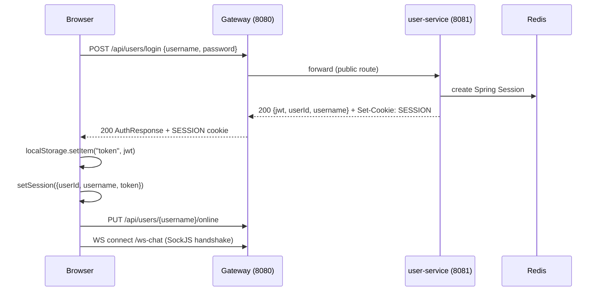
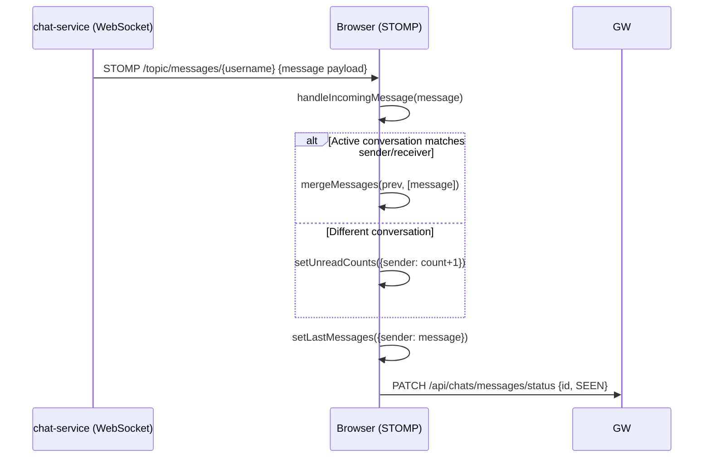
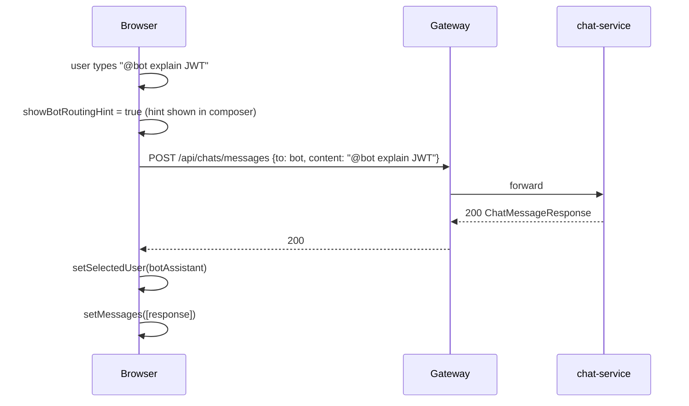

# Chat Assist UI — Requirements Document

---

## 1. Functional Requirements

### FR-UI-01 Authentication
- The UI shall provide Login and Registration forms.
- On login success, the JWT shall be stored in `localStorage` and the session state updated.
- On registration, the returned JWT shall auto-authenticate the user.
- Guest access shall be available without credentials; guest users see only assistant contacts.

### FR-UI-02 Session Restoration
- On every page load, the UI shall call `GET /api/users/session` to restore an active server-side session.
- If the call returns 401, the UI shall show the login screen.
- If the call succeeds, the UI shall resume the full authenticated experience without prompting for login.

### FR-UI-03 Contact List
- The UI shall display all registered human users (excluding self) sorted by: online first, then by most-recently-active, then alphabetically.
- The UI shall display bot and aid assistants in a collapsible section.
- Each contact shall show: name initials, online/offline indicator, last active time.
- A search box shall filter contacts by name or username.

### FR-UI-04 Chat Panel
- Selecting a contact shall load the conversation history from `GET /api/chats/conversation`.
- Messages shall be displayed in chronological order with sender avatar, content, timestamp, and status (SENT / DELIVERED / SEEN).
- The chat panel shall auto-scroll to the latest message.
- Incoming messages via WebSocket shall be merged into the active conversation.

### FR-UI-05 Message Send
- The composer shall support Enter to send and Shift+Enter for new line.
- Content shall be validated (non-empty, max length) before submission.
- Validation errors shall display inline in the composer.

### FR-UI-06 Real-Time WebSocket
- The UI shall connect to `/ws-chat` via SockJS/STOMP after login.
- The UI shall subscribe to `/topic/messages/{username}` and `/topic/status/{username}`.
- Incoming messages shall update the active conversation or increment the unread badge.
- Message status updates shall update tick marks in the message bubble.
- WebSocket shall reconnect automatically after disconnection (5-second delay).

### FR-UI-07 @bot and @aid Mention Routing
- When a user types `@bot` or `@aid` in a non-assistant conversation, a routing hint shall appear in the composer.
- On send, the message shall be routed to the referenced assistant and the UI shall switch to that assistant's conversation.

### FR-UI-08 Unread Badges
- Contacts with unread messages shall show a numeric badge.
- The badge shall clear when the contact is selected and the conversation is loaded.

### FR-UI-09 Last Message Preview
- Each contact in the sidebar shall show the most recent message content (truncated) and timestamp.

### FR-UI-10 Activity Panel
- An activity toggle shall reveal today's login count and distinct chat peer count for the logged-in user.
- Activity numbers for all users shall also be displayed when the panel is open.

### FR-UI-11 Presence Management
- On login, the UI shall call `PUT /api/users/{username}/online`.
- On page close/unload (`beforeunload`, `pagehide`), the UI shall call `PUT /api/users/{username}/offline` with `keepalive: true`.
- On logout, the UI shall call `POST /api/users/logout`.

### FR-UI-12 Session Expiry Handling
- When the API returns `401`, the UI shall dispatch a `chatassist:unauthorized` event.
- The event handler shall clear all state and redirect to the login screen.

---

## 2. Non-Functional Requirements

### NFR-UI-01 Performance
- Initial bundle load shall complete in under 2 seconds on a standard connection.
- Contact directory shall refresh every 30 seconds without causing full re-renders.
- Activity data shall refresh every 60 seconds.

### NFR-UI-02 Responsiveness
- The layout shall be usable on mobile devices (320px+) with a slide-in contact panel.

### NFR-UI-03 Accessibility
- Interactive elements shall have `aria-label` attributes.
- The app shall be navigable by keyboard.

### NFR-UI-04 Security
- JWT tokens shall be sent as `Authorization: Bearer <token>` with every API request.
- Session cookies (`SESSION`) shall be included via `credentials: 'include'`.
- The UI shall not log or expose JWT tokens in the browser console.

### NFR-UI-05 Resilience
- API errors shall display a non-blocking inline error message rather than crashing the app.
- WebSocket disconnections shall trigger automatic reconnect.

---

## 3. High-Level Architecture

```
Browser
  |
  +--HTTP/REST (credentials: include + Bearer token)--> Gateway (8080)
  |                                                          |
  +--WebSocket (SockJS/STOMP)--> Gateway (8080)         downstream services
                                      |
                              chat-service (8082)
```

---

## 4. High-Level Design

| Component | Responsibility |
|---|---|
| `App.jsx` | Global state, WebSocket client, session lifecycle |
| `AuthPage.jsx` | Login + registration forms + guest access |
| `AppRail.jsx` | Left icon rail with user identity and activity toggle |
| `AppSidebar.jsx` | Contact list, search, presence, last-message preview |
| `ChatPanel.jsx` | Message list, composer, routing hints, loading state |
| `MessageBubble.jsx` | Message display with status tick marks |
| `api/client.js` | Fetch wrapper: auth headers, 401 event dispatch |
| `utils/constants.js` | Service base URLs from env / defaults |
| `utils/session.js` | localStorage JWT persistence, guest session creator |
| `utils/formatting.js` | Date formatting, initials, message sort/merge |
| `utils/validation.js` | Composer content validation |

---

## 5. Low-Level Design

### Session Bootstrap (on app load)
```
loadInitialSession()       // read JWT from localStorage
if session → setSessionBootstrapComplete(true)
else
  GET /api/users/session
  if 200 → setSession(data)
  if 401 → setSession(null) → show AuthPage
  finally → setSessionBootstrapComplete(true)
```

### WebSocket Lifecycle
```
useEffect [session]
  if session
    new SockJS(chatWsUrl) → STOMP Client
    client.onConnect()
      client.subscribe(/topic/messages/{session.username})
      client.subscribe(/topic/status/{session.username})
    client.activate()
    return () → client.deactivate()
```

### Send Message Flow
```
handleSendMessage(event)
  validateMessageContent(draft) → composerError if invalid
  determine target (direct / @bot routing / @aid routing)
  POST /api/chats/messages { ...payload }
  on success → mergeMessages, setDraft("")
  on error → setComposerError / setError
```

---

## 6. Technology Mapping

| Concern | Technology |
|---|---|
| Language | JavaScript ES2022 |
| Framework | React 18 (hooks-based) |
| Bundler | Vite 6.x |
| WebSocket | @stomp/stompjs 7.x + sockjs-client 1.x |
| HTTP | Native fetch (custom wrapper) |
| State | React useState / useRef / useMemo |
| Testing | Vitest 2.x + @testing-library/react 16.x + jsdom |
| Containerisation | Docker + Nginx |

---

## 7. Sequence Diagrams

### 7.1 Login Flow



### 7.2 Real-Time Message Receive



### 7.3 Send Message with @bot Routing



---

## 8. API Design

The UI is a consumer of all service APIs. Summary of calls made:

| Method | URL | Trigger |
|---|---|---|
| POST | /api/users/login | Login form submit |
| POST | /api/users/register | Register form submit |
| GET | /api/users/session | App load (session restore) |
| POST | /api/users/logout | Logout button |
| GET | /api/users?excludeUsername= | On session start + 30s poll |
| GET | /api/users/assistants | On session start + 30s poll |
| PUT | /api/users/{u}/online | On session start |
| PUT | /api/users/{u}/offline | On beforeunload |
| GET | /api/users/{u}/activity/today | On session start + 60s |
| GET | /api/users/activity/today | On session start + 60s |
| GET | /api/chats/conversation | On contact select |
| POST | /api/chats/messages | On message send |
| PATCH | /api/chats/messages/status | On message receive / conversation load |
| GET | /api/chats/{u}/activity/today | On session start + 60s |
| GET | /api/chats/activity/today | On session start + 60s |
| WS | /ws-chat (STOMP) | On session start |

---

## 9. Database Diagram

The UI has no database. All state is managed via:

- **React state** (in-memory, cleared on logout)
- **localStorage**: JWT token, guest session flag
- **SESSION cookie**: managed by the browser / Spring Session

---

## 10. UI Design

### Screen: Login / Register

```
+──────────────────────────────────────────────────+
│              Chat Assist                         │
│  ┌──────────────────────────────────────────┐    │
│  │  Username: [________________]            │    │
│  │  Password: [________________]            │    │
│  │  [    Login    ]  [  Register  ]         │    │
│  │  ──────────────────────────────          │    │
│  │  [ Continue as Guest ]                   │    │
│  └──────────────────────────────────────────┘    │
+──────────────────────────────────────────────────+
```

### Screen: Main Chat Interface

```
+──────────────────────────────────────────────────────────────────+
│  [Rail]  [────── Sidebar ──────]  [────── Chat Panel ───────]    │
│           Search: [__________]    Contact: Bob Jones             │
│  [User]   ◉ Alice (online)        ┌─────────────────────────┐   │
│           ○ Bob   (2h ago)        │  Alice: Hello!     10:01│   │
│  [Logout] ─ Assistants ─          │  Bob: Hi Alice!    10:02│   │
│           🤖 bot                   │  Alice: @bot ...   10:03│   │
│           🏥 aid                   │  bot: Here's...    10:04│   │
│                                   └─────────────────────────┘   │
│                                   [Type a message...  ] [Send]  │
+──────────────────────────────────────────────────────────────────+
```

### Key UI Interactions

| Interaction | Visual Feedback |
|---|---|
| Online user | Green dot indicator |
| Unread messages | Orange numeric badge on contact |
| Message SENT | Single grey tick |
| Message DELIVERED | Double grey tick |
| Message SEEN | Double blue tick |
| @bot / @aid mention | Yellow routing hint banner in composer |
| Guest mode | Activity panel hidden; human contacts hidden |
| Session expire | Auto-redirect to login screen |
