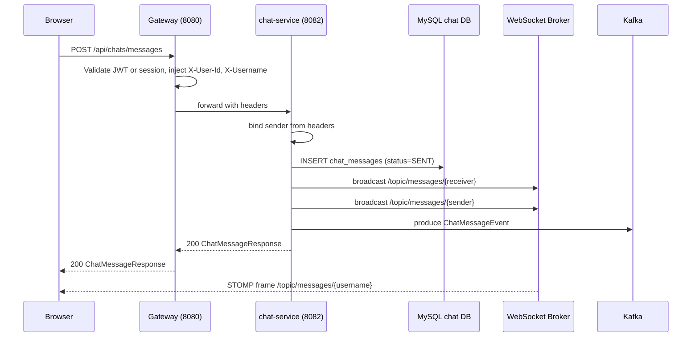
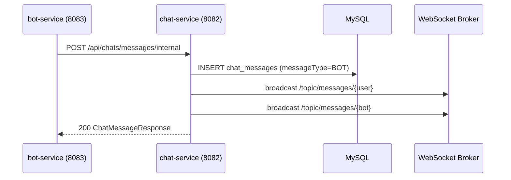
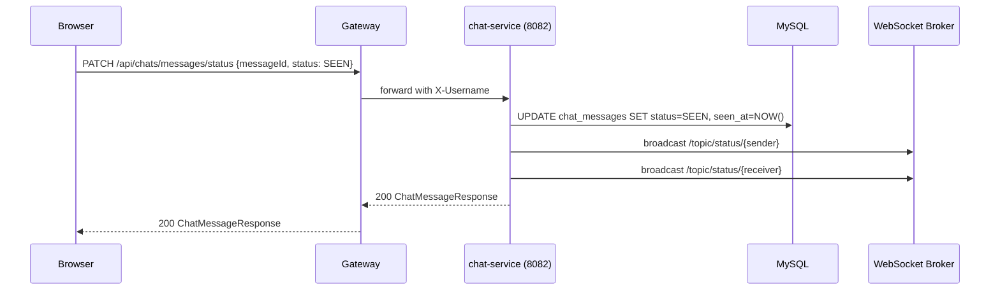
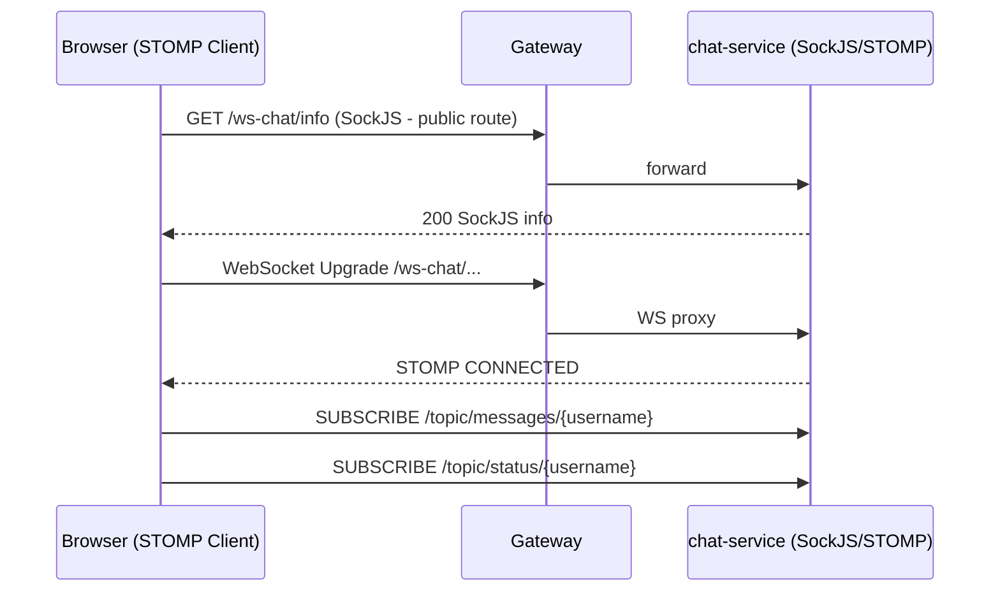

# Chat Service - Requirements Document

---

## 1. Functional Requirements

### FR-CS-01 Send User Message
- Authenticated users shall send text messages to another user or assistant.
- Sender identity is bound to trusted gateway headers (X-User-Id, X-Username) or JWT, never the request body.
- The message is persisted in `chat_messages` with initial status `SENT`.
- A WebSocket broadcast fires to both sender and receiver STOMP topics.
- A `ChatMessageEvent` is published to Kafka topic `chat-messages`.

### FR-CS-02 Send Internal (Bot-Generated) Message
- The service exposes `/api/chats/messages/internal` for bot/aid-service replies.
- Internal messages bypass identity re-binding (no gateway header required).
- Same persist, broadcast, and Kafka publish pipeline applies.

### FR-CS-03 Conversation History
- Authenticated users retrieve ordered message history between two participants.
- Requester must be one of the two participants; otherwise HTTP 403.
- Results are ordered by `sent_at` ascending.

### FR-CS-04 Message Status Update
- Users update a message status to `DELIVERED` or `SEEN`.
- A WebSocket status broadcast fires on each update.

### FR-CS-05 Daily Chat Activity
- The service returns a per-user count of distinct chat peers for the current day.
- An all-users aggregated view is available for any authenticated user.

### FR-CS-06 Assistant Routing
- Messages to `bot` or `aid` propagate to the respective assistant via Kafka.
- `@bot` or `@aid` mentions inside user-to-user chats store `contextUsername` so replies surface in the original thread.

### FR-CS-07 WebSocket Real-Time Delivery
- Sent messages broadcast to `/topic/messages/{receiver}` and `/topic/messages/{sender}`.
- Status changes broadcast to `/topic/status/{receiver}` and `/topic/status/{sender}`.

---

## 2. Non-Functional Requirements

### NFR-CS-01 Performance
- Message send latency (p95) < 300 ms.
- Conversation fetch for 1,000 messages (p95) < 200 ms.

### NFR-CS-02 Reliability
- Kafka publish is fire-and-forget; assistant delivery is eventually consistent.
- WebSocket is best-effort; client re-fetches history on reconnection.
- Gateway retries GET requests on BAD_GATEWAY, SERVICE_UNAVAILABLE, GATEWAY_TIMEOUT.

### NFR-CS-03 Security
- Sender identity is authoritative from gateway headers; request body values are replaced.
- `/api/chats/messages/internal` is reachable only from internal services.

### NFR-CS-04 Scalability
- Stateless service; WebSocket is in-process (suitable for sticky sessions or future shared broker).

### NFR-CS-05 Observability
- Logs: `logs/chat-service.log`, `logs/chat-service-error.log`.
- Actuator: health and info endpoints.

---

## 3. High-Level Architecture

```
Browser --WS--> Gateway (8080) --> chat-service (8082)
Browser --REST-> Gateway (8080) --> chat-service (8082)
                                         |
                              +----------+----------+
                              |          |          |
                         MySQL(3308)  Redis      Kafka
                        chat_messages           chat-messages
                                                   |
                                        +----------+----------+
                                    bot-service          aid-service
```

---

## 4. High-Level Design

| Component | Responsibility |
|---|---|
| `ChatController` | REST handling; identity extraction; delegation |
| `ChatMessagingService` | Persist, broadcast, publish |
| `ChatEventPublisher` | Kafka event publication |
| `WebSocketNotifier` | STOMP topic broadcast |
| `ChatMessageMapper` | Entity to DTO conversion |
| `ChatMessage` | JPA entity for `chat_messages` |
| `WebSocketConfig` | STOMP broker and SockJS endpoint |

---

## 5. Low-Level Design

### Send Message Flow
```
ChatController.sendMessage(request, headers)
  bind senderId/senderUsername from trusted headers or JWT
  ChatMessagingService.send(sanitizedRequest, isInternal=false)
    ChatMessageRepository.save(new ChatMessage, status=SENT)
    WebSocketNotifier to /topic/messages/{receiver} and /topic/messages/{sender}
    ChatEventPublisher: KafkaTemplate.send('chat-messages', event)
```

### Status Update Flow
```
ChatController.updateStatus(StatusUpdateRequest)
  ChatMessagingService.updateStatus(request)
    ChatMessageRepository.findById  -> 404 if missing
    ChatMessage.markDelivered or markSeen
    ChatMessageRepository.save
    WebSocketNotifier to /topic/status/{sender} and /topic/status/{receiver}
```

---

## 6. Technology Mapping

| Concern | Technology |
|---|---|
| HTTP | Spring Boot Web (Spring MVC) |
| Language | Java 21 |
| WebSocket | Spring WebSocket + STOMP + SockJS |
| ORM | Spring Data JPA / Hibernate |
| Database | MySQL 8+ |
| Event Bus | Apache Kafka (spring-kafka) |
| Cache | Redis (spring-cache) |
| Service Discovery | Netflix Eureka |
| Load Balancing | Spring Cloud LoadBalancer |
| API Docs | springdoc-openapi 2.8.x + Spring REST Docs |
| Testing | JUnit 5, Mockito, AssertJ, TestContainers |

---

## 7. Sequence Diagrams

### 7.1 Send Message (Full Flow)



### 7.2 Bot Reply via Internal Endpoint



### 7.3 Message Status Update



### 7.4 WebSocket Handshake



---

## 8. API Design

### Base URL
```
http://localhost:8082/api/chats   (direct)
http://localhost:8080/api/chats   (via gateway)
```

### Endpoints

| Method | Path | Request | Response |
|---|---|---|---|
| POST | /api/chats/messages | ChatMessageRequest | ChatMessageResponse |
| POST | /api/chats/messages/internal | ChatMessageRequest | ChatMessageResponse |
| GET | /api/chats/conversation?userA=&userB= | - | List of ChatMessageResponse |
| GET | /api/chats/{username}/activity/today | - | DailyChatPeerSummary |
| GET | /api/chats/activity/today | - | List of DailyChatPeerSummary |
| PATCH | /api/chats/messages/status | StatusUpdateRequest | ChatMessageResponse |

### HTTP Status Codes

| Code | Meaning |
|---|---|
| 200 | Success |
| 400 | Validation error |
| 401 | Missing authentication |
| 403 | Conversation participant mismatch |
| 404 | Message not found (status update) |

---

## 9. Database Diagram

```
chat-service MySQL database (port 3308)

+--------------------------------------------------------------+
|                       chat_messages                          |
+--------------------------------------------------------------+
| id               BIGINT PK AUTO_INCREMENT                    |
| sender_id        BIGINT NOT NULL                             |
| sender_username  VARCHAR(255) NOT NULL                       |
| receiver_id      BIGINT NOT NULL                             |
| receiver_username VARCHAR(255) NOT NULL                      |
| content          VARCHAR(4000) NOT NULL                      |
| message_type     VARCHAR(20)  [USER | BOT]                   |
| status           VARCHAR(20)  [SENT | DELIVERED | SEEN]      |
| sent_at          DATETIME(6) NOT NULL                        |
| delivered_at     DATETIME(6) NULL                            |
| seen_at          DATETIME(6) NULL                            |
| context_username VARCHAR(255) NULL                           |
+--------------------------------------------------------------+
INDEX: (sender_username, receiver_username, sent_at)
INDEX: (receiver_username, status)
INDEX: (context_username)
```

---

## 10. UI Design

| UI Element | chat-service API |
|---|---|
| Message Send button / Enter key | POST /api/chats/messages |
| Load conversation on contact select | GET /api/chats/conversation |
| Mark messages seen | PATCH /api/chats/messages/status |
| Real-time message delivery | WS /topic/messages/{username} |
| Real-time status ticks | WS /topic/status/{username} |
| Chat activity panel | GET /api/chats/{username}/activity/today |
| All-user chat activity | GET /api/chats/activity/today |
