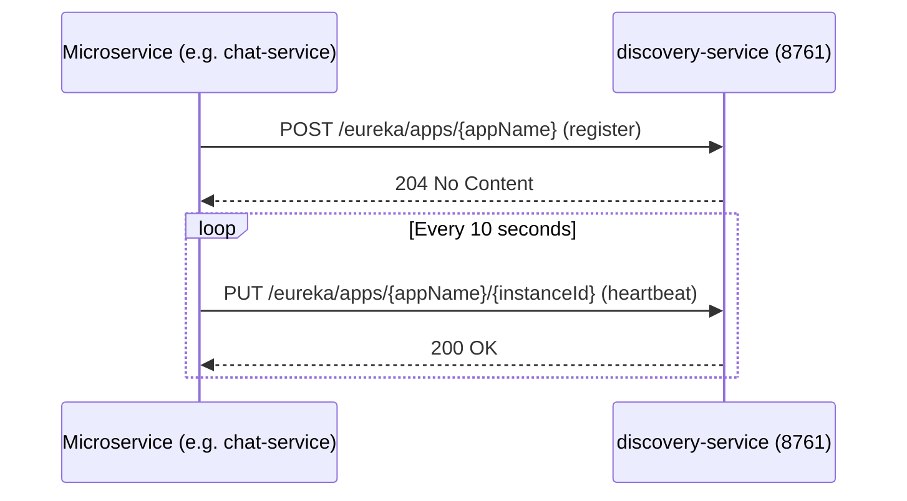
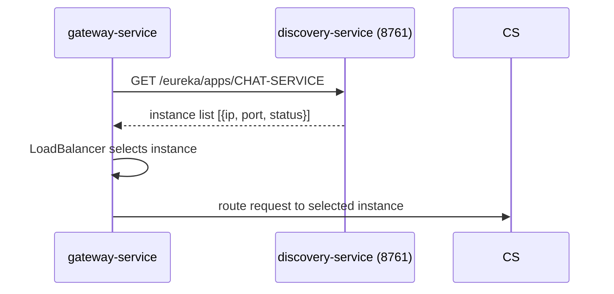

# Discovery Service — Requirements Document

---

## 1. Functional Requirements

### FR-DS-01 Service Registry
- The discovery service shall maintain a registry of all running microservice instances.
- Services shall register on startup and de-register on shutdown.
- Each instance shall send heartbeats every 10 seconds; a lease expires after 30 seconds of no heartbeat.

### FR-DS-02 Registry UI
- The Eureka web dashboard shall be accessible at `http://localhost:8761` for operational inspection.

### FR-DS-03 Client Load Balancing Support
- The registry data shall be consumable by Spring Cloud LoadBalancer in `gateway-service` and other services for instance resolution.

### FR-DS-04 Standalone Mode
- In development, the discovery service shall run in standalone (single-node) mode with `registerWithEureka: false` and `fetchRegistry: false` to avoid self-registration loops.

---

## 2. Non-Functional Requirements

### NFR-DS-01 Availability
- The discovery service shall start before all other services in Docker Compose (health-check dependency chain).
- If the discovery service is temporarily unavailable, registered services shall use their local cached registry copy.

### NFR-DS-02 Observability
- Logs: `logs/discovery-service.log`, `logs/discovery-service-error.log`.
- Eureka dashboard shows instance health and renewal times.

---

## 3. High-Level Architecture

```
discovery-service (8761)
        ^
        | register / heartbeat
        |
   +----+----+----+----+-----+
   |         |    |    |     |
user-svc  chat-svc bot  aid  gateway
```

---

## 4. High-Level Design

The discovery service is a pure Eureka server with no custom business logic.
Configuration is in `application.yml`.

---

## 5. Low-Level Design

```
@SpringBootApplication
@EnableEurekaServer
public class DiscoveryServiceApplication {
  main -> SpringApplication.run(...)
}
```

Eureka server behaviour is fully governed by `application.yml`:
- `server.port: 8761`
- `eureka.client.registerWithEureka: false`
- `eureka.client.fetchRegistry: false`

---

## 6. Technology Mapping

| Concern | Technology |
|---|---|
| Language | Java 21 |
| Framework | Spring Boot 3.x |
| Registry | Spring Cloud Netflix Eureka Server |
| Build | Maven 3 |

---

## 7. Sequence Diagrams

### 7.1 Service Registration



### 7.2 Service Lookup (Gateway)



---

## 8. API Design

The discovery service exposes the standard Eureka REST API:

| Method | Path | Description |
|---|---|---|
| POST | /eureka/apps/{appName} | Register instance |
| PUT | /eureka/apps/{appName}/{instanceId} | Heartbeat |
| DELETE | /eureka/apps/{appName}/{instanceId} | De-register |
| GET | /eureka/apps | List all registered apps |
| GET | /eureka/apps/{appName} | List instances for app |

---

## 9. Database Diagram

The discovery service has **no persistent database**. Registry data is held in memory.

---

## 10. UI Design

The Eureka dashboard at `http://localhost:8761` shows:

| Panel | Description |
|---|---|
| System Status | Environment, uptime, replicas |
| DS Replicas | Peer Eureka nodes (none in single-node mode) |
| Instances currently registered | All registered services with status UP/DOWN |
| General Info | Total instances, renewals per minute |
