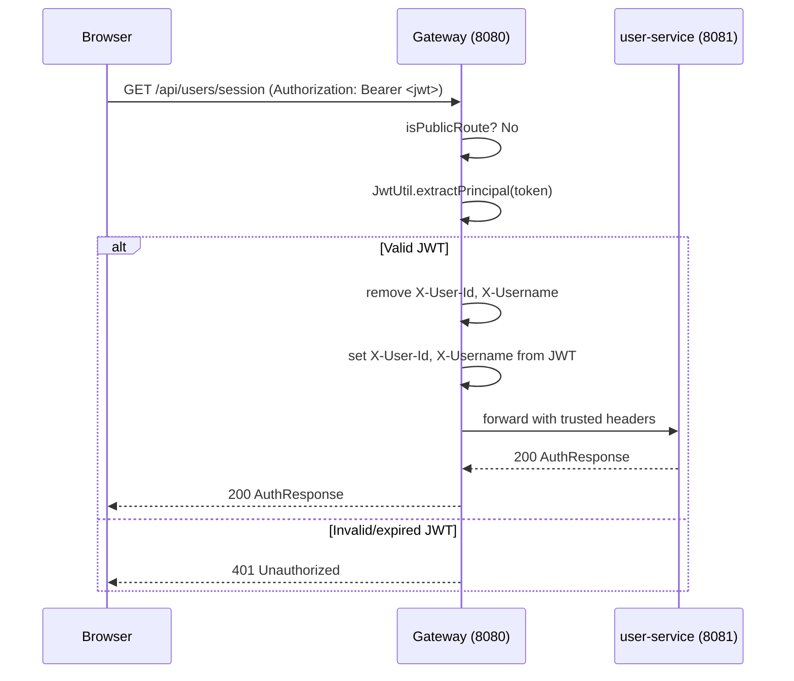
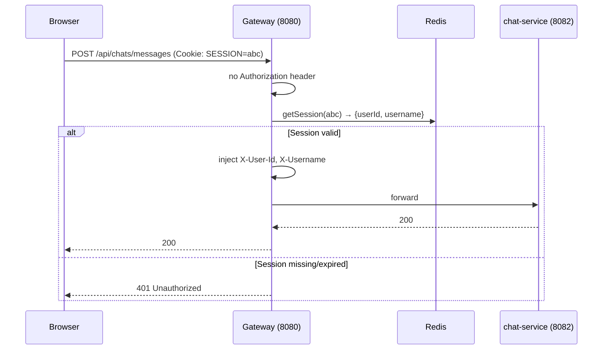
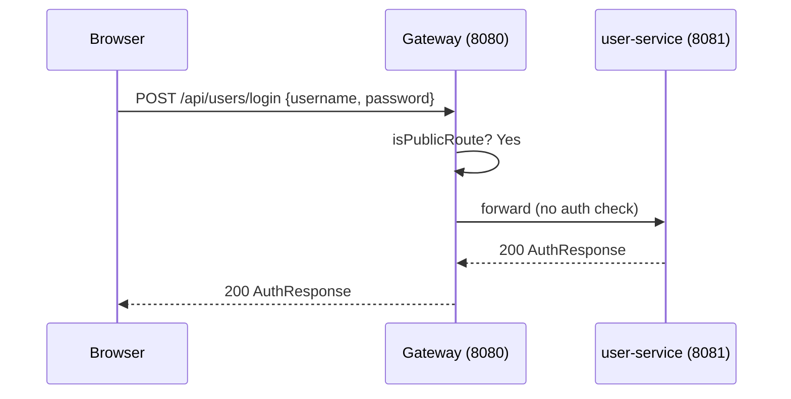

# Gateway Service — Requirements Document

---

## 1. Functional Requirements

### FR-GW-01 Request Routing
- The gateway shall route all `/api/users/**` requests to `user-service` via Eureka load balancing.
- The gateway shall route all `/api/chats/**` requests to `chat-service` with retry on transient failures.
- The gateway shall proxy `/ws-chat/**` WebSocket connections to `chat-service`.
- The gateway shall forward all other traffic to the `chat-assist-ui` frontend container.

### FR-GW-02 Public Route Passthrough
- Exact public routes (login, register, assets, health) shall bypass authentication.
- Swagger UI (`/swagger-ui`) and OpenAPI docs (`/v3/api-docs`) prefixes shall be public.

### FR-GW-03 JWT Authentication
- If a request carries `Authorization: Bearer <token>`, the JWT shall be validated via `JwtUtil`.
- Valid token: extract `userId` and `username`, inject `X-User-Id` and `X-Username` headers.
- Invalid/expired token: reject immediately with `HTTP 401` — no session fallback.

### FR-GW-04 Session Authentication
- If no Bearer header is present on a protected route, the gateway shall attempt to resolve a Redis-backed Spring Session from the `SESSION` cookie.
- Valid session: inject `X-User-Id` and `X-Username` headers.
- Missing/expired session: reject with `HTTP 401`.

### FR-GW-05 Header Injection Security
- Before injecting identity headers, the gateway shall **remove** any existing `X-User-Id` and `X-Username` headers from the incoming request to prevent header-injection attacks.

### FR-GW-06 Retry Policy
- GET requests to `chat-service` shall be retried up to 2 times on `BAD_GATEWAY`, `SERVICE_UNAVAILABLE`, `GATEWAY_TIMEOUT` with exponential backoff (100ms → 500ms).

### FR-GW-07 CORS
- CORS shall be configured for `/api/**` routes, allowing `http://localhost:3000` and `http://localhost:8080` with credentials and all HTTP methods.

---

## 2. Non-Functional Requirements

### NFR-GW-01 Performance
- Gateway overhead (auth + route) shall add less than 10 ms to request latency (p95).
- Redis session reads shall use a 2-second timeout.

### NFR-GW-02 Availability
- The gateway shall register with Eureka and heartbeat every 10 seconds.
- The session store (Redis) timeout is 5 minutes; sessions auto-expire.

### NFR-GW-03 Security
- JWT secrets are managed via `JwtUtil` in `common-service`; not exposed via config.
- Session namespace: `chatassist:session`.

### NFR-GW-04 Observability
- Logs: `logs/gateway-service.log`, `logs/gateway-service-error.log`.
- Actuator: health, info, gateway endpoints.

---

## 3. High-Level Architecture

```
Internet / Browser
        |
        v
  Gateway (8080)
        |
   +----+----+----------+
   |         |          |
user-service  chat-service  chat-assist-ui
  (8081)       (8082)         (:80)
               |
           WebSocket
```

---

## 4. High-Level Design

| Component | Responsibility |
|---|---|
| `AuthenticationFilterConfig` | Global Spring Cloud Gateway filter; auth logic |
| `GatewaySessionService` | Interface for session principal resolution |
| `RedisGatewaySessionService` | Redis-backed session lookup using Spring Session |
| `WebSessionConfig` | Configures Redis session store and namespace |
| `application.yml` routes | Declarative route table for all downstream services |

---

## 5. Low-Level Design

### Authentication Filter Logic
```
authenticationFilter(exchange, chain)
  path = exchange.request.URI.path

  1. isPublicRoute(path)?  --> chain.filter(exchange)  [no auth]

  2. authHeader starts with "Bearer "?
      token = authHeader.substring(7)
      principal = JwtUtil.extractPrincipal(token)
      if principal present --> buildAuthenticatedExchange(userId, username) --> chain.filter
      else                 --> HTTP 401

  3. sessionService.resolveAuthenticatedPrincipal(exchange)
      if principal.userId != null --> buildAuthenticatedExchange --> chain.filter
      else                        --> HTTP 401

buildAuthenticatedExchange(exchange, userId, username)
  headers.remove("X-User-Id")
  headers.remove("X-Username")
  headers.set("X-User-Id", userId)
  headers.set("X-Username", username)
```

---

## 6. Technology Mapping

| Concern | Technology |
|---|---|
| Language | Java 21 |
| Framework | Spring Cloud Gateway (reactive) |
| JWT | JwtUtil (JJWT) from common-service |
| Session Store | Redis (spring-session-data-redis) |
| Service Discovery | Netflix Eureka |
| Load Balancing | Spring Cloud LoadBalancer |
| Build | Maven 3 |
| Testing | JUnit 5, Mockito |

---

## 7. Sequence Diagrams

### 7.1 JWT-Authenticated Request



### 7.2 Session-Based Request



### 7.3 Public Route (No Auth)



---

## 8. API Design

The gateway itself exposes no REST API — it proxies all routes. Key routing rules:

| Incoming path | Downstream | Method |
|---|---|---|
| /api/users/** | user-service | All |
| /api/chats/** | chat-service | All |
| /ws-chat/** | chat-service | WS |
| /** | chat-assist-ui | GET |

Headers injected downstream on authenticated requests:

| Header | Value |
|---|---|
| `X-User-Id` | Authenticated user's numeric ID |
| `X-Username` | Authenticated user's username |

---

## 9. Database Diagram

The gateway-service has **no persistent database**. It reads session data from Redis:

```
Redis (chatassist:session namespace)
  Key: chatassist:session:<sessionId>
  Value: { userId, username, ... Spring Session attributes }
  TTL: 5 minutes (configurable)
```

---

## 10. UI Design

The gateway is transparent to the UI. The browser only sees:

- `http://localhost:8080` as the single base URL
- `SESSION` cookie set on login (from user-service, proxied through gateway)
- `401 Unauthorized` responses when session expires, triggering logout in the React app
