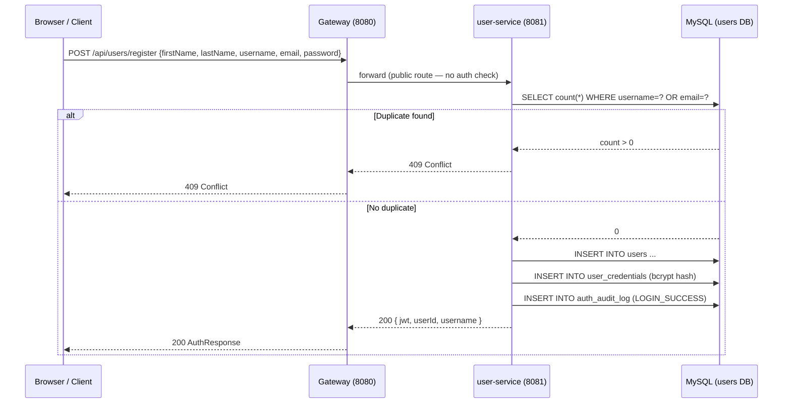
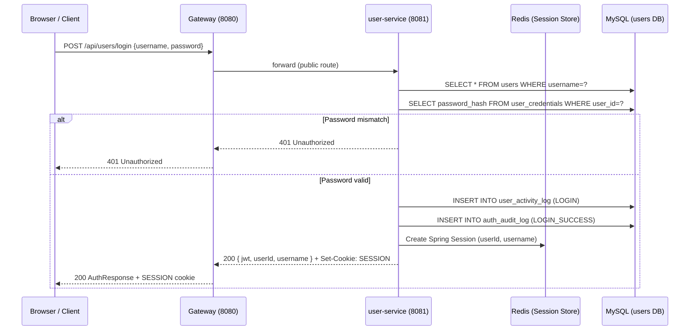
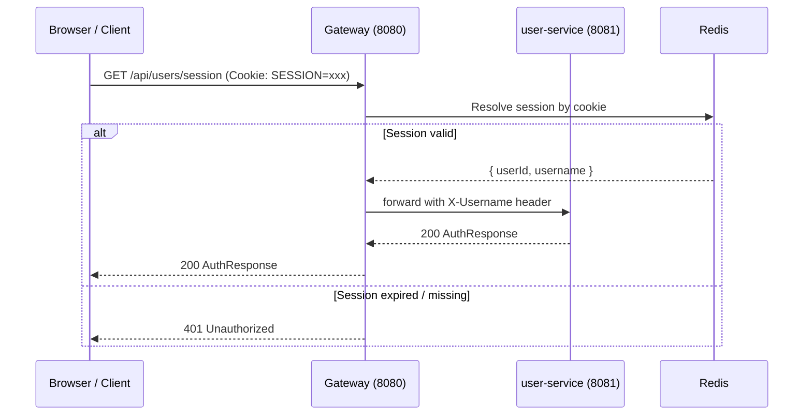
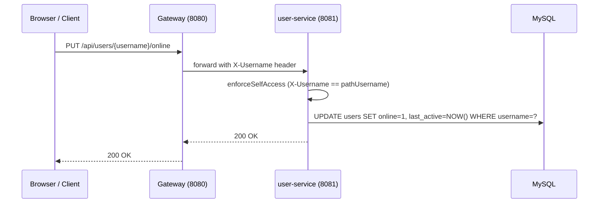

# User Service — Requirements Document

---

## 1. Functional Requirements

### FR-US-01 User Registration
- The system shall allow a new user to register with `firstName`, `lastName`, `username`, `email`, and `password`.
- Usernames and email addresses shall be unique across the platform.
- Passwords shall be stored as BCrypt hashes; plaintext passwords shall never be persisted.
- On success, the system shall return a JWT token and a `userId`.

### FR-US-02 User Authentication
- The system shall authenticate a user via `username` + `password`.
- On successful login, a JWT token shall be issued and a Redis-backed server-side session shall be created.
- On failed login, an `HTTP 401` shall be returned.
- Any pre-existing session shall be invalidated before creating a new one.

### FR-US-03 Session Restoration
- The system shall provide an endpoint to retrieve the currently authenticated session using either the `X-Username` header (injected by the gateway) or an active `SESSION` cookie.
- If no active session exists, `HTTP 401` shall be returned.

### FR-US-04 User Directory
- Authenticated users shall be able to list all registered users, with the option to exclude a specified username from the result.
- The directory endpoint shall return `firstName`, `lastName`, `username`, `online` status, and `lastActive` time.

### FR-US-05 Assistant Listing
- The system shall expose a **public** endpoint that returns the list of assistant users (bot/aid) without requiring authentication.

### FR-US-06 Presence Management
- Authenticated users shall be able to mark themselves as `online` or `offline`.
- Each presence update shall record a `lastActive` timestamp.
- The system shall enforce self-access only — a user cannot update another user's presence.

### FR-US-07 Logout
- Authenticated users shall be able to log out via `POST /api/users/logout`.
- Logout shall: mark the user offline, record a LOGOUT activity event, invalidate the server-side session, and clear the `SESSION` / `JSESSIONID` cookies.
- A legacy path `POST /api/users/{username}/logout` shall be supported for backward compatibility (deprecated).

### FR-US-08 Daily Activity Tracking
- The system shall record a `LOGIN` event for each successful login.
- The system shall record a `LOGOUT` event for each explicit logout.
- Authenticated users shall be able to retrieve their own today's login/logout count summary.
- An aggregated summary for all users shall be available to any authenticated user.

### FR-US-09 Auth Audit Log
- The system shall maintain a separate `auth_audit_log` table recording `LOGIN_SUCCESS`, `LOGIN_FAILED`, and `LOGOUT` events for security audit purposes.

---

## 2. Non-Functional Requirements

### NFR-US-01 Security
- Passwords shall use BCrypt with a minimum cost factor of 10.
- JWT tokens shall be signed and validated by `JwtUtil` from `common-service`.
- The gateway shall strip and re-inject `X-User-Id` and `X-Username` headers to prevent header-injection attacks.
- Session cookies shall be `HttpOnly` and cleared on logout.

### NFR-US-02 Performance
- User login response time shall be under 500 ms (p95) under normal load.
- The user directory listing shall respond in under 200 ms (p95) for up to 10,000 registered users.

### NFR-US-03 Availability
- The service shall register with Eureka and support load-balanced requests via Spring Cloud LoadBalancer.
- The service shall expose `/actuator/health` for gateway and container health checks.

### NFR-US-04 Scalability
- The service shall be stateless (session state in Redis) to allow horizontal scaling.

### NFR-US-05 Observability
- Structured application logs shall be written to `logs/user-service.log` and `logs/user-service-error.log`.
- Actuator endpoints (`health`, `info`) shall be exposed.

### NFR-US-06 Maintainability
- API documentation shall be auto-generated via springdoc-openapi and available at `/swagger-ui.html`.
- Database schema shall be managed by `init-db.sql/user-service/01-schema.sql` and JPA `ddl-auto: update`.

---

## 3. High-Level Architecture

```
┌────────────────────────────────────────────────────────────────────────┐
│                          chat-assist-app                               │
│                                                                        │
│  Browser ──► Gateway (8080) ──► user-service (8081)                   │
│                                       │                               │
│                              ┌────────┴────────┐                      │
│                              │                 │                      │
│                           MySQL (3307)       Redis                    │
│                        user-service DB    (Session Store)             │
└────────────────────────────────────────────────────────────────────────┘
```

The user-service is a standalone Spring Boot application behind the API gateway. It owns its own MySQL database and reads/writes Redis for server-side session data.

---

## 4. High-Level Design

| Component | Responsibility |
|---|---|
| `UserController` | Receives HTTP requests, validates headers, delegates to `UserService` |
| `UserService` | Business logic: registration, login, directory, presence, activity |
| `AuthSessionService` | Session creation, lookup, and invalidation via Spring Session / Redis |
| `AppUser` | JPA entity — user profile |
| `UserCredential` | JPA entity — password hash and security meta |
| `UserActivityLog` | JPA entity — LOGIN/LOGOUT event log |
| `AuthAuditLog` | JPA entity — security audit trail |
| `OpenApiConfig` | Swagger/OpenAPI customisation |

---

## 5. Low-Level Design

### Registration Flow
```
UserController.register(RegisterUserRequest)
  └─► UserService.register(request)
        ├─► UserRepository.existsByUsername() / existsByEmail()  → 409 if duplicate
        ├─► AppUser entity created
        ├─► UserRepository.save(user)
        ├─► UserCredential with BCrypt hash → UserCredentialRepository.save()
        ├─► AuthAuditLog(LOGIN_SUCCESS) → AuthAuditLogRepository.save()
        └─► JwtUtil.generateToken(userId, username) → return AuthResponse
```

### Login Flow
```
UserController.login(LoginRequest, HttpServletRequest)
  └─► UserService.login(request)
        ├─► UserRepository.findByUsername() → 401 if not found
        ├─► BCrypt.checkpw(password, hash) → 401 if mismatch
        ├─► UserActivityLog(LOGIN) → save
        ├─► AuthAuditLog(LOGIN_SUCCESS) → save
        └─► return AuthResponse(jwt, userId, username)
  └─► AuthSessionService.initializeAuthenticatedSession(session, userId, username)
```

### Logout Flow
```
UserController.logoutCurrentUser(authenticatedUsername, session, response)
  └─► UserService.logout(username)
        ├─► AppUser.setOnline(false) → save
        ├─► UserActivityLog(LOGOUT) → save
        └─► AuthAuditLog(LOGOUT) → save
  └─► AuthSessionService.invalidate(session)
  └─► clearSessionCookies(response)   // clears SESSION and JSESSIONID
```

---

## 6. Technology Mapping

| Concern | Technology |
|---|---|
| HTTP Framework | Spring Boot Web (Spring MVC) |
| Language | Java 21 |
| ORM | Spring Data JPA (Hibernate) |
| Database | MySQL 8+ |
| Password Hashing | BCrypt (`spring-security-crypto`) |
| JWT | Custom `JwtUtil` (JJWT) from `common-service` |
| Session Store | Redis via Spring Session |
| Service Discovery | Netflix Eureka (spring-cloud-netflix) |
| Load Balancing | Spring Cloud LoadBalancer |
| API Docs | springdoc-openapi-starter-webmvc-ui 2.8.x |
| Build | Maven 3 / Spring Boot Maven Plugin |
| Testing | JUnit 5, Mockito, Spring Boot Test, TestContainers (MySQL) |
| Containerisation | Docker (Dockerfile.backend) |

---

## 7. Sequence Diagrams

### 7.1 User Registration



### 7.2 User Login



### 7.3 Session Restoration



### 7.4 Presence Update



---

## 8. API Design

### Base URL
```
http://localhost:8081/api/users   (direct)
http://localhost:8080/api/users   (via gateway)
```

### Request / Response Models

#### `POST /api/users/register`
```json
// Request
{
  "firstName": "Alice",
  "lastName": "Smith",
  "username": "alice",
  "email": "alice@example.com",
  "password": "secret123"
}

// Response 200
{
  "userId": 1,
  "username": "alice",
  "token": "<jwt>"
}
```

#### `POST /api/users/login`
```json
// Request
{
  "username": "alice",
  "password": "secret123"
}

// Response 200
{
  "userId": 1,
  "username": "alice",
  "token": "<jwt>"
}
```

#### `GET /api/users`
```json
// Response 200 (array)
[
  {
    "id": 2,
    "firstName": "Bob",
    "lastName": "Jones",
    "username": "bob",
    "online": true,
    "lastActive": "2026-04-06T10:00:00Z"
  }
]
```

#### `GET /api/users/{username}/activity/today`
```json
// Response 200
{
  "username": "alice",
  "loginCount": 2,
  "logoutCount": 1,
  "date": "2026-04-06"
}
```

### HTTP Status Codes

| Code | Meaning |
|---|---|
| `200` | Success |
| `400` | Validation error (missing / invalid fields) |
| `401` | Missing or invalid authentication |
| `403` | Access to another user's resource |
| `404` | User not found |
| `409` | Username or email already registered |

---

## 9. Database Diagram

```
┌──────────────────────────────────────────────────────────────────────────────────┐
│                          user-service MySQL database                             │
│                                                                                  │
│  ┌──────────────────────┐        ┌────────────────────────────────────────────┐  │
│  │        users         │        │           user_credentials                 │  │
│  ├──────────────────────┤        ├────────────────────────────────────────────┤  │
│  │ id (PK)              │◄──────►│ user_id (PK, FK → users.id)               │  │
│  │ first_name           │        │ password_hash                              │  │
│  │ last_name            │        │ password_algo                              │  │
│  │ username (UNIQUE)    │        │ password_changed_at                        │  │
│  │ email (UNIQUE)       │        │ failed_attempt_count                       │  │
│  │ bot (BIT)            │        │ locked_until                               │  │
│  │ online (BIT)         │        │ created_at                                 │  │
│  │ last_active          │        │ updated_at                                 │  │
│  └──────────────────────┘        └────────────────────────────────────────────┘  │
│                                                                                  │
│  ┌──────────────────────────────┐  ┌──────────────────────────────────────────┐  │
│  │     user_activity_log        │  │          auth_audit_log                  │  │
│  ├──────────────────────────────┤  ├──────────────────────────────────────────┤  │
│  │ id (PK)                      │  │ id (PK)                                  │  │
│  │ username                     │  │ user_id (FK → users.id, nullable)        │  │
│  │ event_type (LOGIN|LOGOUT)    │  │ username                                 │  │
│  │ event_time                   │  │ event_type (LOGIN_SUCCESS|FAILED|LOGOUT) │  │
│  │ activity_date                │  │ event_time                               │  │
│  └──────────────────────────────┘  │ client_ip_hash                           │  │
│                                    │ user_agent_hash                          │  │
│                                    │ reason_code                              │  │
│                                    │ meta_json (JSON)                         │  │
│                                    └──────────────────────────────────────────┘  │
└──────────────────────────────────────────────────────────────────────────────────┘
```

---

## 10. UI Design

The User Service does not own a UI. Its data is surfaced in the `chat-assist-ui` in the following ways:

| UI Area | user-service API used |
|---|---|
| **Login screen** | `POST /api/users/login` |
| **Registration screen** | `POST /api/users/register` |
| **Session restoration on app load** | `GET /api/users/session` |
| **User contact list (sidebar)** | `GET /api/users?excludeUsername=...` |
| **Assistant list** | `GET /api/users/assistants` |
| **Online indicator (green dot)** | `online` field in user directory |
| **Last seen time** | `lastActive` field in user directory |
| **Presence on tab focus** | `PUT /api/users/{username}/online` |
| **Presence on page close** | `PUT /api/users/{username}/offline` |
| **Logout button** | `POST /api/users/logout` |
| **Activity panel** | `GET /api/users/{username}/activity/today` |
| **All-user activity panel** | `GET /api/users/activity/today` |

